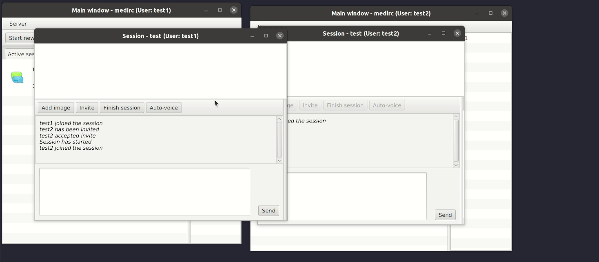

# medirc
Interactive text chat with collaborative photo review.

## Features

 - Server using netty framework, protobuf
 - JavaFX GUI client
 - Multi-user, multi-session (room) with invite system
 - Text chat
 - Uploading photos to sessions
 - Simple photo manipulation support: drawing rectangles on them, ability to focus other session participants view on specific area
 - Voice/auto-voice system for photo manipulation
 - Simple user account system with auto creation of new accounts
 - Session archive which allows participants to download and view sessions they took part in

